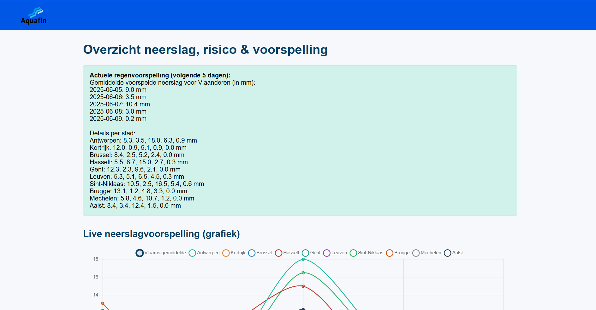
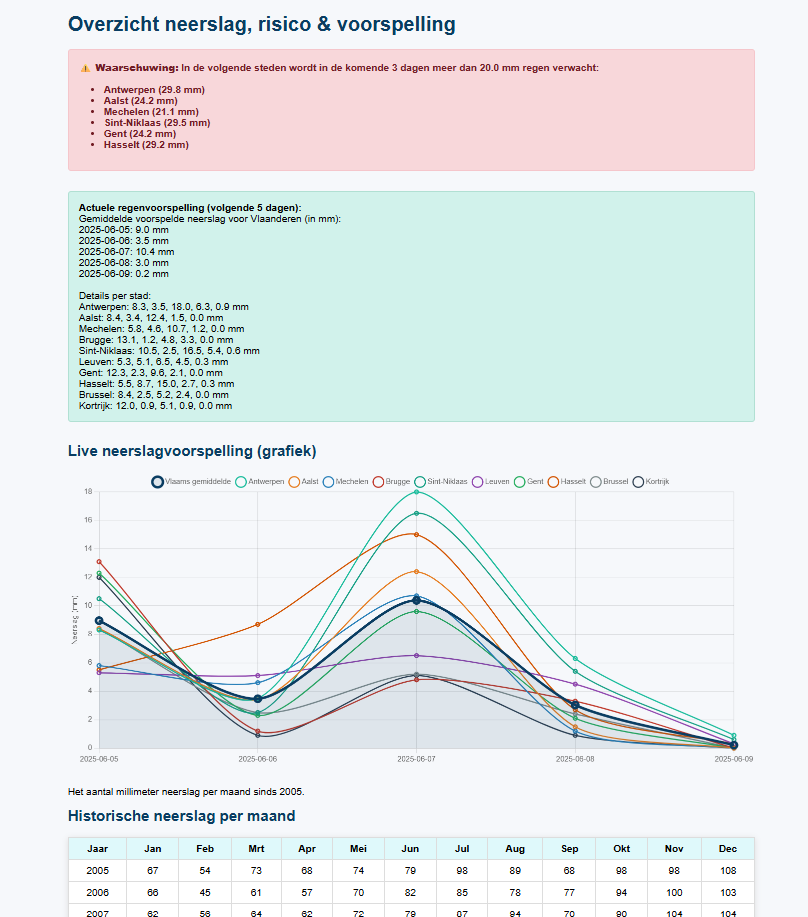
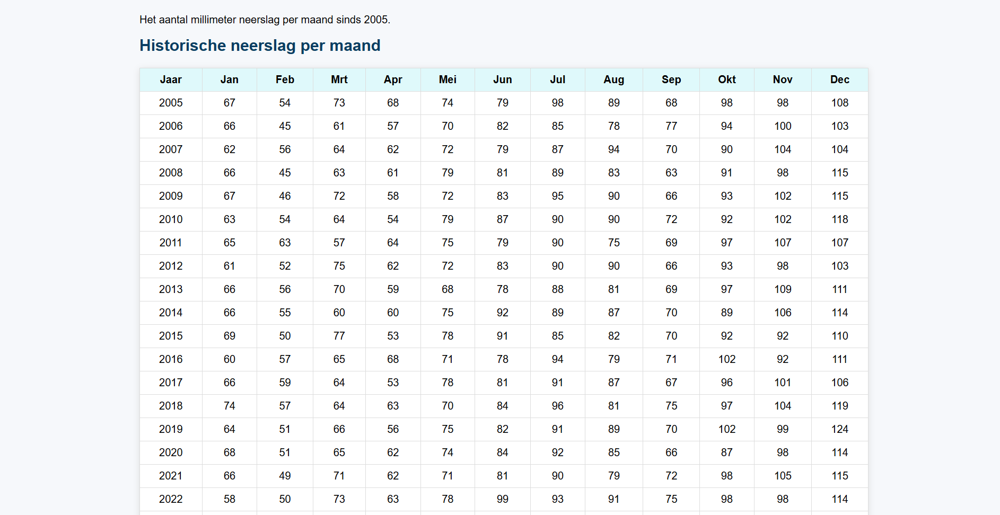

# Aquafin Overstromingsrisico Webapp

Deze webapplicatie toont het actuele en historische overstromingsrisico in Vlaanderen op basis van maandelijkse neerslagdata en live voorspellingen.

## Functionaliteiten

- **Live overstromingswaarschuwing:**  
  Als er in één Vlaamse stad in de komende 3 dagen 40mm of meer neerslag voorspeld wordt, verschijnt bovenaan een waarschuwing.
- **Actuele voorspelling:**  
  5-daagse neerslagvoorspelling voor 10 Vlaamse steden, opgehaald via de Open-Meteo API.  
  Toont het Vlaams gemiddelde, per stad én als interactieve grafiek.
- **Historische data:**  
  Tabel met alle maandelijkse neerslag van 2005 t/m 2025.  
  Voor 2025 worden ontbrekende maanden als `X` weergegeven.
- **Branding:**  
  Professionele header en footer in Aquafin-stijl met logo en officiële contactgegevens.

## Gebruikte technologieën

- Java 17
- Spring Boot
- Thymeleaf (view templates)
- Chart.js (grafieken)
- Open-Meteo API (live data)
- HTML/CSS (custom, responsive)
- Maven

## Team

- Abdul
- Noah
- Kim
- Dalil
- Raihane

## Installatie

1. **Clone de repo:**  
2. **Open in IntelliJ of Eclipse.**
3. **Voer uit als Spring Boot-app:**  
4. **Ga naar:**  
   [http://localhost:8080/](http://localhost:8080/)

## Bestandenstructuur

- `src/main/java/be/ehb/pp_case2/controller/IndexController.java`: Hoofdcontroller, dataverwerking, API-calls
- `src/main/java/be/ehb/pp_case2/service/WeatherService.java`: Service voor het ophalen & verwerken van weerdata
- `src/main/resources/templates/index.html`: Frontend (Thymeleaf)
- `src/main/resources/static/images/`: Logo en statische bestanden

## Screenshots

### Overzichtspagina

### Live neerslagvoorspelling en waarschuwing + grafiek

### Historische neerslagtabel (incl. 2025)

## Bronnen

- https://open-meteo.com/
- https://www.aquafin.be/nl-be
- https://chat.openai.com/
- Alle ehb cursussen van dit jaar

